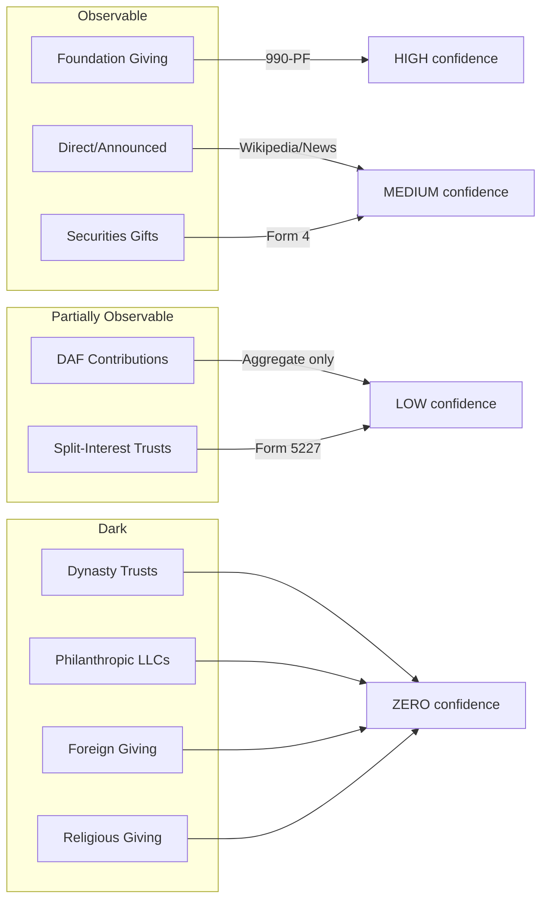

# Scrooge List

An inverse Forbes list — ranks billionaires by how little of their fortune they've deployed for charity.

**[View the live Scrooge List](https://jonahwei19.github.io/scrooge-list/)** (GitHub Pages)

## What This Does

Takes the Forbes Real-Time Billionaires list (3,000+ people) and calculates a **Scrooge Score** (0-100) based on:

1. **Observable giving** relative to liquid wealth
2. **Tenure as billionaire** (longer = higher expectation)
3. **Giving Pledge compliance** (signed but not delivered)
4. **Red flags** (low payout rates, DAF transfers, high compensation)

Higher score = more Scrooge-like behavior.

## The Formula

```
Total Annual Giving = Foundation + DAF + Direct + Securities + Split-Interest + Dark
```

Each channel has different observability. The pipeline estimates what it can.

## Channel Estimation



## Data Pipeline

```
┌─────────────────────────────────────────────────────────────────────┐
│ STAGE 1: Forbes Pull                                                │
│   Fetches 3,163 billionaires from Forbes RTB API                    │
├─────────────────────────────────────────────────────────────────────┤
│ STAGE 2: Foundation Match                                           │
│   Searches ProPublica for 990-PF filings matching name              │
│   Returns: foundation assets, grants paid, payout rate              │
├─────────────────────────────────────────────────────────────────────┤
│ STAGE 3: Announced Gifts                                            │
│   Scrapes Wikipedia + Million Dollar List + DuckDuckGo              │
│   Returns: total announced giving, gift count                       │
├─────────────────────────────────────────────────────────────────────┤
│ STAGE 4: Securities Gifts                                           │
│   Parses SEC EDGAR Form 4 XML for transaction code "G"              │
│   Returns: total stock gifts                                        │
├─────────────────────────────────────────────────────────────────────┤
│ STAGE 5: Red Flags                                                  │
│   Flags: LOW_PAYOUT, NO_OBSERVABLE_GIVING, PLEDGE_UNFULFILLED       │
│   Flags: DAF_TRANSFERS, HIGH_COMP                                   │
├─────────────────────────────────────────────────────────────────────┤
│ STAGE 6: Giving Pledge                                              │
│   Cross-references 401 pledgers from IPS dataset                    │
│   Key finding: only 9 of 256 have fulfilled their pledge            │
├─────────────────────────────────────────────────────────────────────┤
│ STAGE 7: Political Giving                                           │
│   FEC/OpenSecrets data for political donations                      │
│   Used as substitution signal (political replaces charitable)       │
├─────────────────────────────────────────────────────────────────────┤
│ STAGE 8: Wealth Factors                                             │
│   Estimates liquidity (20-70% based on wealth source)               │
│   Tracks tenure as billionaire (affects expectations)               │
├─────────────────────────────────────────────────────────────────────┤
│ STAGE 9: Dark Estimates                                             │
│   Estimates giving through opaque channels:                         │
│   - DAFs (via foundation→DAF transfers + net worth proxy)           │
│   - LLCs (CZI, Ballmer Group, etc.)                                 │
│   - Anonymous giving (board seats, gala attendance)                 │
│   - Religious giving (tithing norms by affiliation)                 │
│   - Estate commitments (Giving Pledge + UHNW averages)              │
└─────────────────────────────────────────────────────────────────────┘
```

## Scrooge Score Formula

```
Score = (Observable Weight × Giving Gap) +
        (Tenure Weight × Years Penalty) +
        (Pledge Weight × Breach Penalty) +
        (Flags Weight × Red Flag Penalty)
```

Default weights: 40% / 20% / 20% / 20%

**Components:**

| Component | Calculation |
|-----------|------------|
| Giving Gap | 1 - (observable / expected), where expected = 10% of liquid wealth |
| Years Penalty | 0 for <3 years, scales to max at 20+ years |
| Breach Penalty | 20 points if pledge signer giving <10% of liquid wealth |
| Red Flag Penalty | 5 points per flag (max 20) |

## Estimation Methods by Channel

| Channel | Method | Confidence |
|---------|--------|------------|
| **Foundation Giving** | 990-PF Part XV via ProPublica | HIGH |
| **Announced Gifts** | Wikipedia + Million Dollar List + News | MEDIUM |
| **Securities Gifts** | SEC Form 4 transaction code "G" | MEDIUM |
| **Political Giving** | FEC bulk data | HIGH |
| **DAF Contributions** | Foundation→DAF transfers + NW proxy (0.3%) | LOW |
| **Philanthropic LLCs** | Media coverage only (CZI, Ballmer Group tracked) | VERY LOW |
| **Anonymous Giving** | Board seats ($75K/seat/year) + gala committees | LOW |
| **Religious Giving** | Tithing norms by affiliation (2-10%) | VERY LOW |
| **Estate Plans** | Giving Pledge commitment + UHNW average (20%) | VERY LOW |

## Usage

```bash
# Test with 10 billionaires
python3 main.py --test

# Top 50 US billionaires
python3 main.py --limit 50 --country "United States"

# Full Forbes list (slow, ~3000 API calls)
python3 main.py
```

## Web App

The `docs/` folder contains a GitHub Pages-compatible web app with:

- **Toggleable score weights** — adjust how much each factor matters
- **Dark estimate toggle** — include/exclude estimated DAF/LLC/anonymous giving
- **Liquidity discount** — adjust for illiquid wealth
- **Filters** — by country, pledge status, search by name
- **Sortable columns** — rank by any metric

Deploy to GitHub Pages:

```bash
# Enable GitHub Pages in repo settings, set source to /docs
# Or run locally:
cd docs && python3 -m http.server 8000
```

## Output Fields

| Field | Description |
|-------|-------------|
| `scrooge_score` | 0-100, higher = more Scrooge-like |
| `net_worth_billions` | Forbes net worth |
| `total_observable_millions` | Foundation grants + announced + securities |
| `dark_estimate_millions` | Estimated DAF + LLC + anonymous + religious + estate |
| `liquidity_pct` | Estimated liquid portion (0-1) |
| `years_as_billionaire` | Tenure (affects expectations) |
| `giving_pledge_signed` | From IPS dataset |
| `red_flag_count` | Number of concerning patterns |

## Red Flags

| Flag | Meaning |
|------|---------|
| `NO_OBSERVABLE_GIVING` | $10B+ net worth, <$100M observable |
| `PLEDGE_UNFULFILLED` | Signed Giving Pledge but not on track |
| `LOW_PAYOUT` | Foundation payout <5% (legal minimum) |
| `DAF_TRANSFERS` | >50% of grants go to DAFs (opacity) |
| `HIGH_COMP` | Officer compensation >10% of grants |

## Limitations

1. **Announced gifts** depend on media coverage — smaller billionaires underrepresented
2. **Form 4 gifts** only capture foundation-bound stock — direct charity gifts exempt
3. **Name matching** is fuzzy — may miss some foundations or include false positives
4. **Data lag** — 990-PF filings are 6-12 months behind
5. **LLC opacity** — CZI, Ballmer Group, Emerson Collective don't file 990s
6. **Dark estimates** are approximations — included for directional signal only

## What Remains Unknowable

- **DAF individual accounts** — $251B with zero disclosure
- **Dynasty trusts** — South Dakota alone has $360B+, no public registry
- **Philanthropic LLCs** — no filing requirement
- **Foreign giving** — no country discloses donor names
- **Religious giving** — churches exempt from 990

## Data Sources

| Stage | Source | URL |
|-------|--------|-----|
| 1 | Forbes RTB API | forbes.com |
| 2 | ProPublica Nonprofit Explorer | projects.propublica.org/nonprofits |
| 3 | Wikipedia API + DuckDuckGo | en.wikipedia.org |
| 4 | SEC EDGAR | data.sec.gov |
| 6 | IPS Giving Pledge Dataset | inequality.org |
| 7 | FEC OpenData | api.open.fec.gov |

## Sample Output

Top Scrooge scores from test run:

| Name | Net Worth | Observable | Scrooge Score | Flags |
|------|-----------|------------|---------------|-------|
| Larry Ellison | $245B | $0M | 90.0 | 2 |
| Mark Zuckerberg | $223B | $186M | 89.0 | 2 |
| Elon Musk | $718B | $300M | 81.5 | 1 |
| Bernard Arnault | $194B | $1.4M | 64.0 | 1 |
| Amancio Ortega | $146B | $2.1M | 64.0 | 1 |

## Files

```
projects/scrooge/
├── main.py                         # Pipeline entry point
├── README.md                       # This file
├── stages/
│   ├── stage1_forbes.py            # Forbes API
│   ├── stage2_foundations.py       # ProPublica 990-PF
│   ├── stage3_announced_gifts.py   # Wikipedia + MDL + News
│   ├── stage4_securities.py        # SEC EDGAR Form 4
│   ├── stage5_red_flags.py         # Flag calculation
│   ├── stage6_giving_pledge.py     # IPS cross-reference
│   ├── stage7_political.py         # FEC political giving
│   ├── stage8_wealth_factors.py    # Liquidity + tenure
│   └── stage9_dark_estimates.py    # DAF/LLC/Anonymous/Religious
├── docs/
│   ├── index.html                  # GitHub Pages web app
│   └── scrooge_latest.json         # Latest data for web app
├── output/                         # Pipeline outputs
├── giving_pledge_data.xlsx         # IPS pledger dataset
├── estimation_model.md             # Methodology notes
└── scrooge_data_sources.md         # Research notes
```

## Academic Background

- **Political/charitable substitution:** NBER 26616 finds $1 increase in political giving → $0.33 decrease in charitable
- **DAF opacity:** 68% of Giving Pledge signers funnel through DAFs (IPS study)
- **Pledge fulfillment:** Only 9 of 256 pledgers have fulfilled commitment
- **Dynasty trusts:** $360B+ in South Dakota alone with zero disclosure (Pandora Papers)

## Contributing

Pull requests welcome. Priority areas:

1. Better name matching for foundations
2. Additional OSINT sources for announced gifts
3. More sophisticated dark channel estimation
4. Historical trend tracking
