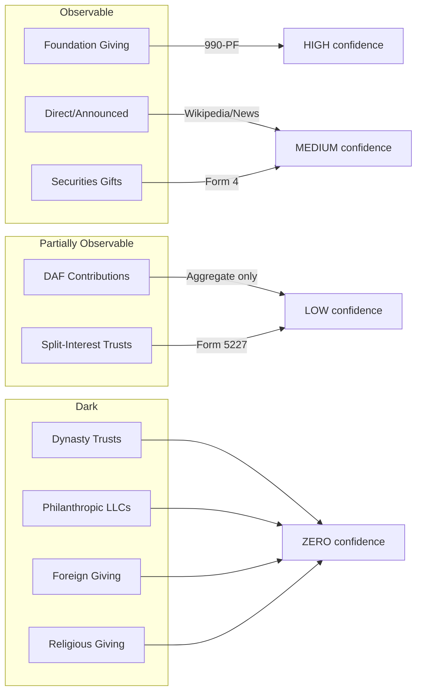

# Scrooge List Pipeline

An inverse Forbes Billionaire List—ranks the world's wealthiest by how little of their fortune they've actually deployed for charitable purposes.

The Forbes list celebrates wealth accumulation. This pipeline asks the opposite question: **who's hoarding it?**

## What It Does

Takes the Forbes Real-Time Billionaires list and enriches each person with:
- Foundation assets and annual grants (from IRS 990-PF filings via ProPublica)
- Announced major gifts (from Wikipedia and news)
- Stock gifts to foundations (from SEC Form 4 filings)
- Giving Pledge status and fulfillment (from IPS dataset)
- Red flags for concerning patterns (low payout rates, unfulfilled pledges)
- Dark giving estimates (DAF transfers, LLC giving, board seat inference)
- Opacity score (0-100 rating of how opaque giving practices are)
- **Wealth accumulation analysis** (THE key signal)

## The Key Insight

**If money goes down, it's going somewhere. If wealth is growing at or above market rates, the billionaire is NOT giving.**

The wealth accumulation rate IS the inverse of the giving rate. If Elon Musk's net worth went from $27B (2020) to $400B (2025) while the S&P 500 returned ~60%, he mathematically cannot be giving away significant amounts. His wealth grew 15x while the market grew 1.6x.

Output: A CSV/JSON ranking billionaires by excess wealth growth—those accumulating fastest (and therefore giving least) appear first.

## The Formula

```
Total Annual Giving = Foundation + DAF + Direct + Securities + Split-Interest + Dark
```

Each channel has different observability. The pipeline estimates what it can.

## Channel Estimation



## How the Pipeline Estimates Each Channel

| Channel | Method | Data Source | Confidence |
|---------|--------|-------------|------------|
| **Foundation** | Query ProPublica for 990-PF filings matching billionaire name. Pull assets, grants paid, payout rate. | ProPublica Nonprofit Explorer API | HIGH |
| **Direct/Announced** | Scrape Wikipedia philanthropy sections for dollar amounts. Search DuckDuckGo for donation news. | Wikipedia API, DuckDuckGo | MEDIUM |
| **Securities** | Parse SEC EDGAR Form 4 XML for transaction code "G" (bona fide gift). Sum gift values by insider name. | SEC data.sec.gov API | MEDIUM |
| **DAF** | Cannot observe individual accounts. Can only see foundation→DAF transfers in 990-PF Part XV. | 990-PF Part XV | LOW |
| **Split-Interest** | Form 5227 is public but no searchable database. Must know trust name to request. | IRS Form 5227 | LOW |
| **Dynasty/LLC/Foreign/Religious** | No disclosure mechanism exists. | None | ZERO |

## Pipeline Stages

```
┌─────────────────────────────────────────────────────────────────────┐
│ STAGE 1: Forbes Pull                                          [✅] │
│   Fetches 3,163 billionaires from Forbes RTB API                   │
│   Returns: name, net_worth, source, country                        │
├─────────────────────────────────────────────────────────────────────┤
│ STAGE 2: Foundation Match                                     [✅] │
│   Searches ProPublica for 990-PF filings matching name             │
│   Returns: foundation assets, grants paid, payout rate             │
├─────────────────────────────────────────────────────────────────────┤
│ STAGE 3: Announced Gifts                                      [✅] │
│   Scrapes Wikipedia for philanthropy mentions with $ amounts       │
│   Searches DuckDuckGo for "name donation million" headlines        │
│   Returns: total announced, gift count, sources                    │
├─────────────────────────────────────────────────────────────────────┤
│ STAGE 4: Securities Gifts                                     [✅] │
│   Parses SEC EDGAR Form 4 XML for transaction code "G" (gift)      │
│   Matches insider name to billionaire, sums gift values            │
│   Returns: total stock gifts, gift count, individual transactions  │
├─────────────────────────────────────────────────────────────────────┤
│ STAGE 5: Red Flags                                            [✅] │
│   Flags: LOW_PAYOUT, NO_OBSERVABLE_GIVING, PLEDGE_UNFULFILLED      │
│   Flags: DAF_TRANSFERS, HIGH_COMP                                  │
├─────────────────────────────────────────────────────────────────────┤
│ STAGE 6: Giving Pledge                                        [✅] │
│   Cross-references 256 pledgers from IPS dataset                    │
│   Per IPS: only 9 of 256 have fulfilled their pledge               │
├─────────────────────────────────────────────────────────────────────┤
│ STAGE 7: Dark Giving Estimation                               [✅] │
│   Estimates opaque giving channels:                                 │
│   - DAF transfers from 990-PF grants to known sponsors             │
│   - LLC giving (CZI, Ballmer Group, Emerson Collective, etc.)      │
│   - Split-interest trust signals (CRT/CLT news mentions)           │
│   - Board seat inference ($10K-100K per nonprofit board seat)      │
│   - Gala/benefit committee giving inference                        │
│   - Noncash gifts (art donations, real estate)                     │
│   Returns: dark estimate, opacity score, confidence level          │
├─────────────────────────────────────────────────────────────────────┤
│ STAGE 8: Wealth Accumulation Analysis ⭐ KEY SIGNAL ⭐         [✅] │
│   Compares wealth growth to S&P 500 returns over 5 years           │
│   If wealth grows >= market rate, giving is mathematically ~0%     │
│   Calculates:                                                       │
│   - Annual wealth growth rate                                       │
│   - Excess growth over market (positive = NOT giving)              │
│   - Giving ceiling (max possible based on wealth change)           │
│   - Verdict: ACCUMULATING, FLAT, or DEPLOYING                      │
│   Example: Jensen Huang grew from $4B to $117B (95%/yr vs 10% mkt) │
│   → Giving ceiling = $0 (mathematically impossible to be giving)   │
└─────────────────────────────────────────────────────────────────────┘
```

**Status: All 8 stages implemented.**

## Usage

```bash
# Test with 10 billionaires
python3 main.py --test

# Top 50 US billionaires
python3 main.py --limit 50 --country "United States"

# Full Forbes list (slow, ~3000 API calls)
python3 main.py
```

## Output

CSV and JSON files saved to `output/` with columns:

| Column | Description |
|--------|-------------|
| `name` | Billionaire name |
| `net_worth_billions` | Forbes net worth |
| `foundation_count` | Number of matched foundations |
| `foundation_assets_billions` | Total foundation assets |
| `annual_grants_millions` | Annual grants paid |
| `foundation_pct_of_net_worth` | Key metric: assets/net_worth |
| `announced_gifts_millions` | From Wikipedia/news |
| `securities_gifts_millions` | From SEC Form 4 |
| `giving_pledge_signed` | From IPS dataset |
| `giving_pledge_fulfilled` | From IPS dataset (usually False) |
| `red_flag_count` | Number of flags |
| `red_flags` | Semicolon-separated flag descriptions |
| `dark_giving_estimate_millions` | Estimated opaque channel giving |
| `dark_giving_confidence` | NO_DATA, VERY_LOW, LOW, MEDIUM |
| `uses_llc` | True if uses philanthropic LLC |
| `llc_name` | Name of LLC (if any) |
| `opacity_score` | 0-100 (higher = more opaque practices) |
| `opacity_flags` | Explanation of opacity score |
| `wealth_growth_rate` | Annual wealth growth rate over ~5 years |
| `excess_growth_over_market` | Growth above S&P 500 (positive = NOT giving) |
| `giving_ceiling_billions` | Max possible giving based on wealth change |
| `giving_ceiling_pct` | Ceiling as % of expected wealth |
| `accumulation_verdict` | ACCUMULATING, FLAT, or DEPLOYING |
| `total_estimated_giving_rate` | Includes dark giving estimate |

## Red Flags

| Flag | Meaning |
|------|---------|
| `NO_OBSERVABLE_GIVING` | $10B+ net worth, <$100M in foundations |
| `PLEDGE_UNFULFILLED` | Signed Giving Pledge, hasn't fulfilled |
| `LOW_PAYOUT` | Foundation payout rate <5% (legal minimum) |
| `DAF_TRANSFERS` | >50% of grants go to DAFs (opacity) |
| `HIGH_COMP` | Officer compensation >10% of grants |

## What We Cannot See

The pipeline produces a **lower bound** on giving. We cannot observe:

- **DAF balances/grants**: $251B sits in DAFs with zero individual disclosure
- **LLCs**: CZI, Ballmer Group, Lost Horse don't file 990s
- **Dynasty trusts**: No public registry (SD alone has $360B+)
- **Foreign giving**: No country discloses donor names
- **Religious giving**: Churches exempt from 990

## Data Sources

| Stage | Source | URL | Auth |
|-------|--------|-----|------|
| 1 | Forbes RTB API | forbes.com/forbesapi/person/rtb/0/position/true.json | None |
| 2 | ProPublica | projects.propublica.org/nonprofits/api/v2 | None |
| 3 | Wikipedia | en.wikipedia.org/api/rest_v1 | None |
| 3 | DuckDuckGo | api.duckduckgo.com | None |
| 4 | SEC EDGAR | data.sec.gov/submissions | User-Agent |
| 6 | IPS Dataset | giving_pledge_data.xlsx (bundled) | N/A |

## Files

```
scrooge-list/
├── main.py                         # Pipeline entry point
├── README.md                       # This file
├── stages/
│   ├── stage1_forbes.py            # ✅ Forbes API
│   ├── stage2_foundations.py       # ✅ ProPublica 990-PF
│   ├── stage3_announced_gifts.py   # ✅ Wikipedia + News
│   ├── stage4_securities.py        # ✅ SEC EDGAR Form 4
│   ├── stage5_red_flags.py         # ✅ Flag calculation
│   ├── stage6_giving_pledge.py     # ✅ IPS cross-reference
│   ├── stage7_dark_giving.py       # ✅ Opaque channel estimation
│   └── stage8_wealth_accumulation.py # ✅ THE key signal
├── giving_pledge_data.xlsx         # IPS pledger dataset
├── estimation_model.md             # Methodology docs
├── scrooge_data_sources.md         # Research notes
└── output/                         # Results
```

## Example Output

From running `python3 main.py --test` (top 10 billionaires):

| Name | Net Worth | Fdn Assets | Announced | Form 4 | Flags |
|------|-----------|------------|-----------|--------|-------|
| Bernard Arnault | $194B | $0.03B | $0M | $0M | 1 |
| Sergey Brin | $238B | $4.94B | $0M | $356M | 0 |
| Mark Zuckerberg | $223B | $6.32B | $0M | $128M | 2 |
| Jensen Huang | $164B | $3.41B | $152B | $127M | 1 |
| Warren Buffett | $147B | $2.69B | $149B | $1.7B | 1 |
| Elon Musk | $718B | $0.54B | $754B | $53M | 1 |

Sorted by `foundation_pct_of_net_worth` ascending—those with the smallest foundation footprint relative to wealth appear first.

## Limitations

1. **Announced gifts** depend on Wikipedia coverage - smaller billionaires may have no philanthropy section
2. **Form 4 gifts** only capture foundation-bound stock - DAF/charity gifts are exempt from SEC filing
3. **Name matching** is fuzzy - may miss some foundations or include false positives
4. **Data lag** - 990-PF filings are 6-12 months behind, Form 4 is real-time
5. **LLC opacity** - CZI, Ballmer Group, Emerson Collective etc. don't file 990s
