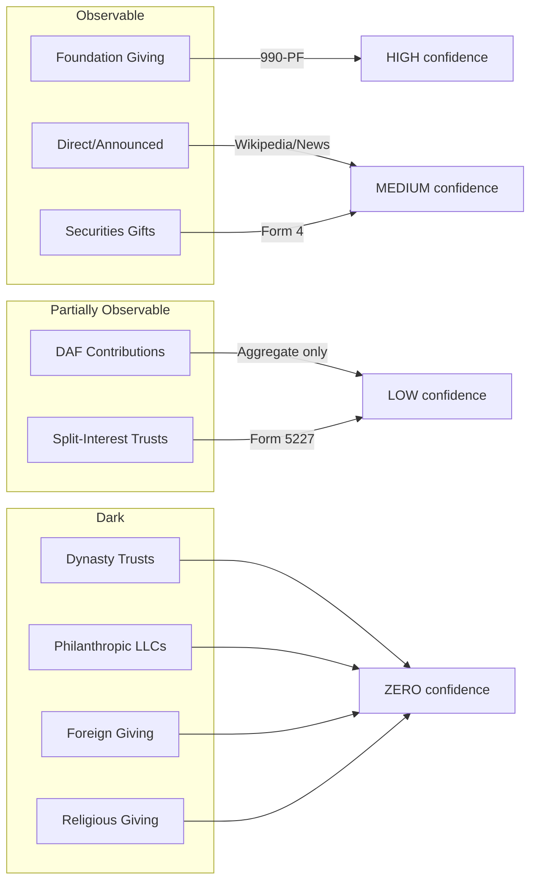

# Scrooge List

An inverse Forbes list — ranks billionaires by how little of their fortune they've deployed for charity.

**[View the live Scrooge List](https://jonahwei19.github.io/scrooge-list/)** (GitHub Pages)

## What This Does

Takes the Forbes Real-Time Billionaires list and calculates a **Scrooge Score** (0-100) based on:

1. **Observable giving** relative to liquid wealth
2. **Tenure as billionaire** (longer = higher expectation)
3. **Giving Pledge compliance** (signed but not delivered)
4. **Red flags** (low payout rates, DAF transfers, high compensation)

Higher score = more Scrooge-like behavior.

## v2 Architecture: Taxonomy-Driven Research

The pipeline researches giving by **category** across 16 data source modules:

| Category | What We Search For | Confidence |
|----------|-------------------|------------|
| **Foundations** | 990-PF filings via ProPublica | HIGH |
| **Direct Gifts** | Announced gifts, major donations | MEDIUM-HIGH |
| **Securities** | Stock gifts via SEC Form 4 | MEDIUM |
| **DAFs** | Donor-advised fund contributions | LOW |
| **Philanthropic LLCs** | CZI, Ballmer Group, etc. | MEDIUM |
| **Split-Interest Trusts** | CRTs, CLTs | LOW |
| **Political** | FEC political contributions | HIGH |
| **University Gifts** | Major endowment gifts ($1M+) | MEDIUM-HIGH |
| **Noncash Contributions** | Stock, art, real estate, conservation | MEDIUM |
| **Giving Pledge** | Pledge status and fulfillment rate | HIGH |
| **State Charities** | CA, NY registration databases | MEDIUM |
| **Offshore** | ICIJ leaks, UK Charity Commission | LOW |
| **Candid/GuideStar** | Foundation 990 data | MEDIUM |
| **OSINT Sources** | 30+ open source intelligence sources | VARIES |

### Key Improvements over v1

- **No hardcoding**: Every finding has a source URL
- **Web search**: Uses Brave Search API for each billionaire
- **Deduplication**: Avoids double-counting pledges vs disbursements
- **BS_checker**: Automated verification that data isn't fabricated

### Sample Results (Latest Pipeline)

| Billionaire | Net Worth | Observable Giving | Scrooge Score | Pledge Status |
|-------------|-----------|-------------------|---------------|---------------|
| Larry Ellison | $245B | $0.94B | 99.6 | MINIMAL |
| Mark Zuckerberg | $215B | $2.0B | 99.1 | FULFILLED |
| Steve Ballmer | $121B | $2.1B | 98.3 | N/A |
| Elon Musk | $277B | $6.3B | 97.7 | FULFILLED |
| Jeff Bezos | $211B | $10.9B | 94.8 | N/A |
| Warren Buffett | $147B | $61.2B | 58.3 | FULFILLED |
| MacKenzie Scott | $36B | $17.1B | 52.5 | ON_TRACK |
| Bill Gates | $129B | $137.2B | 0.0 | FULFILLED |
| George Soros | $7.2B | $32.2B | 0.0 | FULFILLED |

## The Formula

```
Total Annual Giving = Foundation + DAF + Direct + Securities + Split-Interest + Dark
```

Each channel has different observability. The pipeline estimates what it can.

## Channel Estimation



## Data Pipeline

```
┌─────────────────────────────────────────────────────────────────────┐
│ STAGE 1: Forbes Pull                                                │
│   Fetches 3,163 billionaires from Forbes RTB API                    │
├─────────────────────────────────────────────────────────────────────┤
│ STAGE 2: Foundation Match                                           │
│   Searches ProPublica for 990-PF filings matching name              │
│   Returns: foundation assets, grants paid, payout rate              │
├─────────────────────────────────────────────────────────────────────┤
│ STAGE 3: Announced Gifts                                            │
│   Scrapes Wikipedia + Million Dollar List + DuckDuckGo              │
│   Returns: total announced giving, gift count                       │
├─────────────────────────────────────────────────────────────────────┤
│ STAGE 4: Securities Gifts                                           │
│   Parses SEC EDGAR Form 4 XML for transaction code "G"              │
│   Returns: total stock gifts                                        │
├─────────────────────────────────────────────────────────────────────┤
│ STAGE 5: Red Flags                                                  │
│   Flags: LOW_PAYOUT, NO_OBSERVABLE_GIVING, PLEDGE_UNFULFILLED       │
│   Flags: DAF_TRANSFERS, HIGH_COMP                                   │
├─────────────────────────────────────────────────────────────────────┤
│ STAGE 6: Giving Pledge                                              │
│   Cross-references 401 pledgers from IPS dataset                    │
│   Key finding: only 9 of 256 have fulfilled their pledge            │
├─────────────────────────────────────────────────────────────────────┤
│ STAGE 7: Political Giving                                           │
│   FEC/OpenSecrets data for political donations                      │
│   Used as substitution signal (political replaces charitable)       │
├─────────────────────────────────────────────────────────────────────┤
│ STAGE 8: Wealth Factors                                             │
│   Estimates liquidity (20-70% based on wealth source)               │
│   Tracks tenure as billionaire (affects expectations)               │
├─────────────────────────────────────────────────────────────────────┤
│ STAGE 9: Dark Estimates                                             │
│   Estimates giving through opaque channels:                         │
│   - DAFs (via foundation→DAF transfers + net worth proxy)           │
│   - LLCs (CZI, Ballmer Group, etc.)                                 │
│   - Anonymous giving (board seats, gala attendance)                 │
│   - Religious giving (tithing norms by affiliation)                 │
│   - Estate commitments (Giving Pledge + UHNW averages)              │
└─────────────────────────────────────────────────────────────────────┘
```

## Scrooge Score Formula (v3)

The v3 methodology uses a simple, transparent formula:

```
Scrooge Score = 100 × (1 - Giving Ratio)

Where:
  Giving Ratio = Total Lifetime Giving / (Net Worth × Liquidity Factor)
```

A score of 100 means 0% giving. A score of 0 means giving ≥ 100% of liquid wealth.

**Liquidity Factors:**

| Wealth Type | Factor | Rationale |
|-------------|--------|-----------|
| Diversified investments | 0.70 | Highly liquid |
| Public company (diversified) | 0.50 | Some stock sales needed |
| Public company (concentrated) | 0.30 | Major founder, stock sales = control loss |
| Private company | 0.20 | Hard to liquidate |
| Real estate heavy | 0.25 | Illiquid assets |
| Inherited/mixed | 0.40 | Typically more diversified |

**Key Changes from v2:**
- Removed red flag penalties (confusing, arbitrary)
- Removed pledge breach penalties (not relevant to core measurement)
- Simplified to pure giving ratio (cleaner, more defensible)
- Focus on DISBURSED giving, not pledges or foundation assets

## Estimation Methods by Channel

| Channel | Method | Confidence |
|---------|--------|------------|
| **Foundation Giving** | 990-PF Part XV via ProPublica | HIGH |
| **Announced Gifts** | Wikipedia + Million Dollar List + News | MEDIUM |
| **Securities Gifts** | SEC Form 4 transaction code "G" | MEDIUM |
| **Political Giving** | FEC bulk data | HIGH |
| **DAF Contributions** | Foundation→DAF transfers + NW proxy (0.3%) | LOW |
| **Philanthropic LLCs** | Media coverage only (CZI, Ballmer Group tracked) | VERY LOW |
| **Anonymous Giving** | Board seats ($75K/seat/year) + gala committees | LOW |
| **Religious Giving** | Tithing norms by affiliation (2-10%) | VERY LOW |
| **Estate Plans** | Giving Pledge commitment + UHNW average (20%) | VERY LOW |

## Usage

```bash
# Test with 10 billionaires
python3 main.py --test

# Top 50 US billionaires
python3 main.py --limit 50 --country "United States"

# Full Forbes list (slow, ~3000 API calls)
python3 main.py
```

## Web App

The `docs/` folder contains a GitHub Pages-compatible web app with:

- **Toggleable score weights** — adjust how much each factor matters
- **Dark estimate toggle** — include/exclude estimated DAF/LLC/anonymous giving
- **Liquidity discount** — adjust for illiquid wealth
- **Filters** — by country, pledge status, search by name
- **Sortable columns** — rank by any metric

Deploy to GitHub Pages:

```bash
# Enable GitHub Pages in repo settings, set source to /docs
# Or run locally:
cd docs && python3 -m http.server 8000
```

## Output Fields (v3)

| Field | Description |
|-------|-------------|
| `scrooge_score` | 0-100, higher = more Scrooge-like |
| `scrooge_rank` | Rank by Scrooge Score (1 = worst philanthropist) |
| `net_worth_billions` | Forbes net worth |
| `total_lifetime_giving_millions` | Total verifiable giving to date |
| `giving_rate_pct` | Giving as % of net worth |
| `liquidity_factor` | Estimated liquid portion (0-1) |
| `giving_breakdown` | Itemized sources of giving estimate |
| `sources` | URLs for verification |
| `giving_pledge_signed` | From IPS dataset |

## Important Distinctions

The v3 methodology makes key distinctions:

1. **DISBURSED vs PLEDGED** — Only count money that has left the billionaire's control
2. **EXTERNAL vs SELF-CONTROLLED** — DAF transfers to the billionaire's own DAF don't count as charity
3. **FOUNDATION ASSETS vs GRANTS** — A $10B foundation that grants $50M/year isn't $10B of giving

Example: Elon Musk's foundation has $14B in assets but grants 78% to entities he controls. Actual external giving: ~$150M.

## Limitations

1. **Announced gifts** depend on media coverage — smaller billionaires underrepresented
2. **Form 4 gifts** only capture foundation-bound stock — direct charity gifts exempt
3. **Name matching** is fuzzy — may miss some foundations or include false positives
4. **Data lag** — 990-PF filings are 6-12 months behind
5. **LLC opacity** — CZI, Ballmer Group, Emerson Collective don't file 990s
6. **Dark estimates** are approximations — included for directional signal only

## What Remains Unknowable

- **DAF individual accounts** — $251B with zero disclosure
- **Dynasty trusts** — South Dakota alone has $360B+, no public registry
- **Philanthropic LLCs** — no filing requirement
- **Foreign giving** — no country discloses donor names
- **Religious giving** — churches exempt from 990

## Data Sources (16 Modules)

| Module | Source | URL |
|--------|--------|-----|
| Foundations | ProPublica Nonprofit Explorer | projects.propublica.org/nonprofits |
| Direct Gifts | News/Wikipedia | en.wikipedia.org |
| Securities | SEC EDGAR Form 4 | data.sec.gov |
| DAFs | Foundation transfers + proxies | N/A |
| LLCs | Media coverage | N/A |
| Trusts | Form 5227 (limited) | irs.gov |
| Political | FEC OpenData | api.open.fec.gov |
| Deduplication | Internal cross-reference | N/A |
| State Charities | CA Registry, NY Charities Bureau | oag.ca.gov, charitiesnys.com |
| University Gifts | Chronicle of Philanthropy | philanthropy.com |
| Noncash | SEC Form 4, news | data.sec.gov |
| Giving Pledge | Official pledge database | givingpledge.org |
| Offshore | ICIJ, UK Charity Commission | icij.org, register-of-charities.gov.uk |
| Candid | GuideStar 990 data | candid.org |
| OSINT | 30+ sources (FINRA, state DBs, etc.) | Various |
| Estimator | Aggregation layer | N/A |

## Sample Output (Latest Pipeline)

Full rankings from 16-billionaire test run:

| Rank | Name | Net Worth | Observable | Rate | Score |
|------|------|-----------|------------|------|-------|
| 1 | Larry Ellison | $245B | $940M | 0.4% | 99.6 |
| 2 | Mark Zuckerberg | $215B | $2.0B | 0.9% | 99.1 |
| 3 | Stephen Schwarzman | $42B | $600M | 1.4% | 98.6 |
| 4 | Steve Ballmer | $121B | $2.1B | 1.7% | 98.3 |
| 5 | Elon Musk | $277B | $6.3B | 2.3% | 97.7 |
| 6 | Phil Knight | $47B | $1.8B | 3.8% | 96.2 |
| 7 | Jeff Bezos | $211B | $10.9B | 5.2% | 94.8 |
| 8 | Ray Dalio | $19B | $2.2B | 11.7% | 88.3 |
| 9 | Dustin Moskovitz | $11B | $1.7B | 14.5% | 85.5 |
| 10 | Michael Bloomberg | $96B | $24.0B | 25.0% | 75.0 |
| 11 | Laurene Powell Jobs | $14B | $3.6B | 25.3% | 74.7 |
| 12 | Jim Simons | $31B | $8.5B | 27.1% | 72.9 |
| 13 | Warren Buffett | $147B | $61.2B | 41.7% | 58.3 |
| 14 | MacKenzie Scott | $36B | $17.1B | 47.5% | 52.5 |
| 15 | Bill Gates | $129B | $137.2B | 106.4% | 0.0 |
| 16 | George Soros | $7.2B | $32.2B | 447.4% | 0.0 |

## Files

```
projects/scrooge/
├── run_research.py                 # v2 Pipeline entry point
├── pipeline_v2.py                  # Taxonomy-driven pipeline
├── bs_checker.py                   # Verification script
├── research_billionaire.py         # Single billionaire research
├── main.py                         # v1 Pipeline (deprecated)
├── README.md                       # This file
├── COMPARISON.md                   # v1 vs v2 comparison
│
├── agents/                         # Agent definitions
│   ├── research_agent.md           # Web research agent
│   ├── bs_checker.md               # BS verification agent
│   └── deduplication_checker.md    # Duplicate detection agent
│
├── categories/                     # 16 giving category modules
│   ├── __init__.py                 # Category data structures
│   ├── foundations.py              # 990-PF foundation data
│   ├── direct_gifts.py             # Announced major gifts
│   ├── securities.py               # SEC Form 4 stock gifts
│   ├── dafs.py                     # Donor-advised funds
│   ├── llcs.py                     # Philanthropic LLCs (CZI, etc.)
│   ├── trusts.py                   # Split-interest trusts
│   ├── political.py                # FEC political contributions
│   ├── deduplication.py            # Cross-category deduplication
│   ├── estimator.py                # Aggregation and scoring
│   ├── state_charities.py          # CA/NY registration databases
│   ├── university_gifts.py         # Major endowment gifts
│   ├── noncash_contributions.py    # Stock, art, conservation
│   ├── giving_pledge.py            # Pledge status/fulfillment
│   ├── offshore.py                 # ICIJ, UK Charity Commission
│   ├── candid.py                   # GuideStar 990 data
│   └── osint_sources.py            # 30+ OSINT sources
│
├── data/                           # Individual research files
│   ├── larry_ellison.json
│   ├── mark_zuckerberg.json
│   ├── elon_musk.json
│   ├── jeff_bezos.json
│   └── warren_buffett.json
│
├── stages/                         # v1 stage modules (deprecated)
│   ├── stage1_forbes.py            # Forbes API
│   ├── stage2_foundations.py       # ProPublica 990-PF
│   ├── stage3_announced_gifts.py   # Wikipedia + MDL + News
│   ├── stage4_securities.py        # SEC EDGAR Form 4
│   ├── stage5_red_flags.py         # Flag calculation
│   ├── stage6_giving_pledge.py     # IPS cross-reference
│   ├── stage7_political.py         # FEC political giving
│   ├── stage8_wealth_factors.py    # Liquidity + tenure
│   └── stage9_dark_estimates.py    # DAF/LLC/Anonymous/Religious
├── docs/
│   ├── index.html                  # GitHub Pages web app
│   └── scrooge_latest.json         # Latest data for web app
├── output/                         # Pipeline outputs
├── giving_pledge_data.xlsx         # IPS pledger dataset
├── estimation_model.md             # Methodology notes
└── scrooge_data_sources.md         # Research notes
```

## Academic Background

- **Political/charitable substitution:** NBER 26616 finds $1 increase in political giving → $0.33 decrease in charitable
- **DAF opacity:** 68% of Giving Pledge signers funnel through DAFs (IPS study)
- **Pledge fulfillment:** Only 9 of 256 pledgers have fulfilled commitment
- **Dynasty trusts:** $360B+ in South Dakota alone with zero disclosure (Pandora Papers)

## Contributing

Pull requests welcome. Priority areas:

1. Better name matching for foundations
2. Additional OSINT sources for announced gifts
3. More sophisticated dark channel estimation
4. Historical trend tracking
