# Scrooge List: Comprehensive Data Source Inventory

## TIER 1: GOLD STANDARD SOURCES (Direct Disclosure)

### 1. IRS Form 990-PF (Private Foundations)
- API: ProPublica Nonprofit Explorer - https://projects.propublica.org/nonprofits/api/v2
- Data: Foundation assets, grants made (with recipient names/amounts), board members
- Part XV has itemized grant data - the gold standard
- Alternative: NCCS at Urban Institute, Candid/GuideStar

### 2. IPS Giving Pledge Dataset (CRITICAL)
- File: giving_pledge_data.xlsx (already downloaded)
- 256 pledge signers with year joined, citizenship, alive status
- 57 original 2010 US pledgers with complete financial data
- KEY: Only 9 of 256 signers have actually followed through

### 3. SEC Filings (Wealth Tracking)
- Form 4: Insider transactions, filed within 2 business days
- Form 13F: Quarterly institutional holdings
- Access: SEC EDGAR, sec-api.io, OpenInsider.com

### 4. FEC/OpenSecrets (Political Giving)
- All donations over $200 are public
- API: OpenSecrets Donor Lookup, FEC OpenFEC API
- Academic: Stanford DIME dataset (cleaned, entity-resolved)
- Use: Proxy for willingness to deploy wealth

## TIER 2: CURATED PHILANTHROPY DATA

### 5. Chronicle of Philanthropy - Philanthropy 50
- Annual top 50 donors, data back to 2000
- 2024: Only 19 of Forbes 400 appeared (weak correlation wealth -> giving)
- Access: store.philanthropy.com (paid)

### 6. Forbes Philanthropy Scores
- Formula: Out the door giving / (current net worth + lifetime giving)
- Scale 1-5, published with Forbes 400
- CRITICAL: Only counts money that LEFT to operating charities

### 7. Giving USA / Lilly Family School (Indiana U)
- 40+ years of aggregate philanthropy data
- Bank of America Study: Affluent household patterns
- Philanthropy Panel Study: Longitudinal household data

## TIER 3: WEALTH TRACKING SOURCES

### 8. Forbes 400 / Real-Time Billionaires
- Methodology: SEC filings + comparable company multiples + direct outreach
- Historical: Kaggle datasets 1997-2024, Peterson Institute 1996-2015
- Real-time: Top 3 holdings updated on 15-minute delay

### 9. Bloomberg Billionaires Index
- Updated daily at 5:30 PM ET
- Proprietary methodology with 5-star confidence ratings
- Access: Requires Bloomberg Terminal (RICH function)

### 10. Hurun Global Rich List
- UNIQUE: Assigns corporate donations to individual shareholders proportionally
- Applicable to US - could attribute corporate giving to major shareholders

## THE DAF PROBLEM (Major Opacity)

- $251.5B sits in DAFs with NO individual disclosure
- 68% of major gifts from Giving Pledgers go through DAFs/foundations
- Big 3 (Fidelity, Schwab, Vanguard) control ~70% of assets, REFUSE to disclose
- DAF-to-DAF transfers ($16.8B 2020-2023) count as payout but never reach charities
- Larry Page: top black box billionaire - funnels foundation through anonymous DAFs

### Workarounds:
- Track foundation-to-DAF transfers via 990-PF (foundations gave $3.2B to DAFs in 2022)
- DAF Research Collaborative has anonymized account-level data from 111 sponsors
- National Philanthropic Trust publishes aggregate data (only transparent sponsor)

## INTERNATIONAL SOURCES

- UK: Charity Commission Register (monthly extracts), CharityBase, 360Giving
- Netherlands: ANBI register (tax-exempt status, not financials)
- Germany: Finanzamt records (regional, not centralized)
- China: No disclosure; only Hurun estimates + corporate CSR reports
- **KEY: US 990-PF is actually the BEST disclosure regime globally**

## SECONDARY ESTIMATION METHODS

- Wealth accumulation analysis: If net worth grows faster than market + income, not giving
- Major gift announcements: Scrape university/hospital press releases for naming gifts
- Nonprofit board memberships: Correlates with giving (990 Schedule O lists directors)
- Building permits: Match new foundation HQs to billionaire addresses
- Sectoral pattern matching: Education gets 29% of DAF dollars - infer from known interests

## AVAILABLE APIs/DATASETS

| Source | URL | Access |
|--------|-----|--------|
| ProPublica 990 | projects.propublica.org/nonprofits/api/v2 | Free |
| OpenSecrets | opensecrets.org/open-data | Free |
| SEC EDGAR | sec-api.io | Free/Paid |
| Candid Foundation Maps | maps.foundationcenter.org | Paid |
| NCCS (Urban Institute) | datacatalog.urban.org/dataset/nccs-core-files | Free |
| Stanford DIME | data.stanford.edu/dime | Academic |
| Kaggle Forbes | kaggle.com (Forbes Billionaires 1997-2024) | Free |
| IPS Giving Pledge | inequality.org | Free |

## WORST SCROOGES (from IPS data)

### Pledge-Breakers (signed but barely gave):
| Name | Net Worth | % Given | Shortfall |
|------|-----------|---------|-----------|
| Larry Ellison | $162B | 0.6% | $80.6B |
| Ann & John Doerr | $12B | 0.9% | $6.0B |
| Mark Zuckerberg | $174B | 5.7% | $82.0B |
| Jim Simons | $31B | 6.6% | $14.4B |
| Carl Icahn | $4B | 8.3% | $1.8B |

### Never-Pledgers (did not even promise):
- Elon Musk ($428B)
- Jeff Bezos ($244B) 
- Larry Page ($156B)
- Sergey Brin ($148B)
- Jensen Huang ($118B)
- The Waltons ($222B combined)
- Ken Griffin ($47B)

**TOTAL WEALTH OF TOP NON-SIGNERS: $1.58 TRILLION**

## ALTERNATIVE SIGNAL SOURCES (Wealth Deployment Indicators)

### Art Auction Records
- Artnet Price Database: 19M+ records (1985-present), searchable by collector
- Christie's LotFinder, Sotheby's Auction Results
- Signal: Art donations for tax deductions are trackable

### Aircraft Registry (FAA N-Number)
- Fully public: registry.faa.gov
- Owner name, address, aircraft details
- Signal: Jet ownership indicates luxury asset accumulation

### Yacht Registries
- Lloyd's Register of Yachts (historic, digitized 1870-2001)
- SuperYachtFan.com tracks current ownership
- Signal: Superyacht ownership patterns

### Real Estate at Scale
- ATTOM Data: 158M+ US properties via API
- TaxNetUSA, Pubrec (PropMix)
- County assessor direct downloads (LA County, etc.)

### University Endowment Reports
- Most publish major donor lists ($250K+ levels)
- Chronicle of Higher Education tracks major gifts
- Signal: Named endowments directly show giving

### Museum/Hospital Annual Reports
- Patron View Database: 1.67M+ museum donations tracked
- Signal: Named galleries, donor recognition levels

---

## BILLIONAIRE DEEP DIVES

### Jensen Huang ($118B) - STEALTH PHILANTHROPIST
- Foundation: Jen-Hsun & Lori Huang Foundation ($9.1B assets)
- BUT: 2/3 of foundation giving goes to DAFs (Charles Schwab "GeForce Fund")
- Major gifts: Stanford ($30M), Oregon State ($100M total)
- No website, no employees, very low profile
- NOT signed Giving Pledge
- Verdict: Has capacity but maximizes opacity

### Walton Family ($222B combined) - FRAGMENTED GIVING
- Walton Family Foundation: $5B assets, gives ~$550M/year
- BUT: This is <1.5% of family net worth
- 12+ separate foundations make tracking difficult
- Only Christy Walton (daughter-in-law) signed Giving Pledge
- Rob, Jim, Alice have NOT signed individually
- Use CLATs (Charitable Lead Annuity Trusts) - wealth management, not philanthropy
- Crystal Bridges Museum: Genuine public institution, but tax-advantaged

### Larry Page ($156B) - BLACK BOX BILLIONAIRE
- Foundation funnels most giving through anonymous DAFs
- Inside Philanthropy identified as top opacity case
- Impossible to track where money actually goes

### Jeff Bezos ($244B) - SLOW DISBURSEMENT
- Bezos Earth Fund: $10B pledged (2020), only $1.7B disbursed (17%)
- Bezos Day One Fund: $2B committed, ~$522M granted
- Total lifetime giving: ~$4.1B (1.6% of net worth)
- NOT signed Giving Pledge
- Compare: Ex-wife MacKenzie Scott gave $26.3B (36% of her wealth)
- Scott gave $7.1B in 2025 alone - more than Bezos's lifetime total

### Elon Musk ($428B) - FOUNDATION HOARDING
- Musk Foundation: $14B assets (10th largest in US)
- BUT: Failed IRS 5% minimum distribution 4 years running
- 2024 giving: $474M (78% went to single Texas nonprofit run by his aide)
- The $5.7B "donation" (2021): Went to his OWN foundation, not charities
- NOT signed Giving Pledge
- Pattern: Tax deductions without actual charitable deployment

### Larry Ellison ($162B) - WORST PLEDGE COMPLIANCE
- SIGNED Giving Pledge but only 0.6% given
- Total lifetime giving: ~$1.5-1.7B
- Foundations distribute ~$50-100M/year
- At 81, "lifetime" pledge increasingly means estate disposition
- Wealth grew 5-10x since signing; giving didn't keep pace
- Recent $40B pledge to son's business deal framed as "philanthropy"

---

## PART 6: NEW SOURCES DISCOVERED (Jan 2026)

### FREE ACADEMIC DATASETS
| Source | URL | Description |
|--------|-----|-------------|
| Million Dollar List | milliondollarlist.org | All $1M+ gifts since 2000, searchable |
| Chronicle Big Gifts | philanthropy.com/project/big-charitable-gifts | $1M+ individual gifts |
| GivingTuesday 990 Portal | 990data.givingtuesday.org | Research-ready 990 extracts |
| IRS SOI Microdata | irs.gov/statistics | Harmonized 990-PF dataset |
| DAF Research Collaborative | dafresearchcollaborative.org | 50K accounts, 2.25M grants |
| Patron View | patronview.com | 1.67M museum donations tracked |
| Gates Foundation Grants | gatesfoundation.org/about/committed-grants | All committed grants downloadable |

### FREE WEALTH TRACKING APIs
| Source | URL | Description |
|--------|-----|-------------|
| RTB-API | github.com/komed3/rtb-api | Daily Forbes data since 2020 |
| CORGIS Dataset | corgis-edu.github.io/corgis/billionaires | Forbes 1996-2014 with self-made flags |
| SEC EDGAR API | sec.gov/edgar/sec-api-documentation | Form 4, 13F filings |
| FAA Registry | faa.gov bulk download | All US private aircraft |
| OpenSky Network | opensky-network.org | Free global flight tracking |
| OpenCorporates | api.opencorporates.com | 200M+ companies globally |
| CourtListener RECAP | courtlistener.com/recap | Free federal court documents |

### COURT RECORDS FOR DISCLOSURE
| Type | What It Reveals | Notable Examples |
|------|-----------------|------------------|
| Divorce proceedings | Asset disclosures under oath | Heard/Depp: $7M pledged, $1.2M paid |
| Bankruptcy filings | Full creditor/victim lists | Madoff: 13,500 accounts revealed |
| AG investigations | Self-dealing patterns | Trump Foundation: dissolved, $2M penalty |
| Tax Court | Inflated deduction claims | Conservation easement syndicates |
| Probate records | Estate charitable dispositions | Public after death |

### SEARCHABLE COURT DATABASES
- PACER (pacer.uscourts.gov) - Federal courts, $0.10/page
- UniCourt (unicourt.com) - 4,000+ courts, 40+ states
- Judyrecords (judyrecords.com) - 100% free search
- State AG Charity Offices (nasconet.org for directory)

### INTERNATIONAL REGISTRIES
| Country | Source | API? | Bulk? | Detail Level |
|---------|--------|------|-------|--------------|
| UK | Charity Commission | Yes (free) | Yes (daily) | Good - trustees public |
| UK | 360Giving | Yes | Yes | Grant-level data |
| UK | CharityBase | GraphQL | Yes | Enriched data |
| Australia | ACNC | via data.gov.au | Yes (weekly) | Medium |
| Canada | CRA T3010 | No | Via SEAL Lab | Medium |
| Germany | Länder registers | No | No | Poor (fragmented) |
| Netherlands | ANBI list | No | No | Poor |
| Switzerland | ZEWO/StiftungSchweiz | No | No | Voluntary only |

KEY: US 990-PF remains best global disclosure regime

### LIQUID VS ILLIQUID CONSIDERATIONS
- Typical billionaire: ~23% liquid (Wealth-X data)
- High-affinity donors: 46% liquid (enables deployment)
- Forbes applies 10% illiquidity discount to private holdings
- Bloomberg applies 5% discount
- "Buy, borrow, die" means liquidity constraints overstated
- Securities-backed loans: 50-70% of stock value accessible

### PAID PROSPECT RESEARCH TOOLS
- DonorSearch ($2,500-10,000/yr) - Wealth indicators, board affiliations
- iWave/Kindsight - 44+ data sources, Salesforce integration
- WealthEngine ($3,000-15,000/yr) - ML-scored profiles
- Inside Philanthropy - Qualitative funder intelligence
- PitchBook ($15-50K/yr) - Private company valuations
- SuperYacht Times - Yacht ownership database
- Artnet - Art auction records 19M+ since 1985

---

## PART 7: LEAKED DATA SOURCES

### ICIJ Offshore Leaks Database
- URL: https://offshoreleaks.icij.org/
- 810,000+ offshore entities searchable
- Bulk CSV download available
- Neo4j graph database dump
- REST API launched Jan 2025
- Combines: Panama Papers, Paradise Papers, Pandora Papers, Bahamas Leaks

### Key Leak Findings
| Leak | Documents | Key Pattern |
|------|-----------|-------------|
| Panama Papers | 11.5M | Foundation structures hiding UBOs |
| Paradise Papers | 13.4M | Offshore "charitable" vehicles avoiding 5% payout |
| Pandora Papers | 11.9M | South Dakota trusts ($360B+), dynasty planning |
| FinCEN Files | 2,657 SARs | $2T+ suspicious transactions |
| Suisse Secrets | 30K clients | CHF 100B+ in Credit Suisse |

### Academic Analysis of Leaks
- Alstadsaeter/Johannesen/Zucman (2019): Top 0.01% owns 50% of hidden offshore wealth
- 25-30% of taxes evaded by top 0.01% vs 3% average
- PDF: gabriel-zucman.eu/files/AJZ2019.pdf

### Cross-Reference Tools
- OpenSanctions (opensanctions.org) - combines ICIJ with sanctions lists
- LittleSis (littlesis.org) - crowdsourced wealth network mapping

---

## PART 8: FAMILY OFFICE OPACITY

### SEC Exemption
- Family offices exempt from Investment Advisers Act registration
- No AUM cap on exemption
- Codified by Dodd-Frank Section 409 (2011)
- Archegos collapse ($10B losses) led to calls for reform but no legislation

### What IS Disclosed
| Filing | Requirement | What It Shows |
|--------|-------------|---------------|
| Form 13F | $100M+ securities | Quarterly holdings (NOT exempt) |
| Form 13D/G | 5%+ ownership | Activist positions (NOT exempt) |
| Form 990 | Associated foundations | Charitable activity |

### Family Office Databases (Paid)
- FINTRX: 4,300+ family offices, 22,000+ contacts
- Family Office Database: 22,000+ profiles
- Dakota: Institutional-grade data

### Estimates
- US single family offices: 3,000-10,000+
- North American AUM: $1.7T+
- Global SFOs: 8,030 (Deloitte 2024), growing to 10,720 by 2030

---

## PART 9: NAMING RIGHTS TRACKING

### Best Free Sources
- Million Dollar List (milliondollarlist.org) - All $1M+ gifts since 2000
- LittleSis (littlesis.org) - Wealth network mapping, board seats
- Chronicle Big Gifts - $1M+ searchable

### Stadium Naming (Best Documented)
- Sports Business Journal Directory
- ESPN Stadium Names Tracker (free)
- Business of College Sports data

### University/Hospital (No Central Database)
- CASE VSE Survey - aggregate only, not individual donors
- Must search institution by institution
- Named endowed chairs often listed on university websites

### Key Limitation
Naming rights are private contracts - disclosed only when parties choose to publicize. No regulatory mandate.

---

## PART 10: TRUST OPACITY

### Key Finding: NO PUBLIC TRUST REGISTRY EXISTS IN ANY US STATE
- Private/dynasty trusts are not recorded anywhere
- Only charitable trusts register with state AGs

### State Charitable Trust Registries
| State | URL | Searchable |
|-------|-----|------------|
| California | rct.doj.ca.gov | Yes - name, EIN, filings |
| New York | charitiesnys.com | Yes - 5 years financials |
| Illinois | charitable.illinoisattorneygeneral.gov | Yes - assets, income |

### Dynasty Trust Havens (Zero Disclosure)
| State | Key Feature | AUM |
|-------|-------------|-----|
| South Dakota | Unlimited duration, quiet trusts | $360B+ |
| Nevada | Silent trusts, no beneficiary notice | Large |
| Delaware | 360-year dynasty trusts | Large |
| Wyoming | 1,000-year trusts | Growing |

### Only Visible Trust Type: Split-Interest (Form 5227)
- CLATs/CRUTs file Form 5227 with IRS
- "Open to public inspection" per IRS
- BUT: No searchable database exists
- Only aggregate IRS SOI statistics available

---

## PART 11: CORPORATE GIVING OPACITY

### SEC Requires NO Charitable Giving Disclosure
- No general mandate for corporate giving disclosure
- May appear in Item 404(a) if related party
- Usually buried in aggregate expenses

### Best Corporate Giving Data
| Source | Coverage | Access |
|--------|----------|--------|
| CECP Giving in Numbers | 200+ large companies | Annual report |
| Chronicle Corporate Survey | 150 companies | Paid |
| Candid Foundation Directory | 325K grantmakers | Subscription |

### Hurun Attribution Method
- Corporate donations attributed to shareholders proportionally
- Example: If CEO owns 78% of company, 78% of corporate giving credited to them
- Only methodology that traces corporate→individual giving

---

## PART 12: POLITICAL vs CHARITABLE DEPLOYMENT

### Key Academic Finding (NBER 26616)
- Political and charitable giving are SUBSTITUTES
- $1 increase in charitable → $0.42 decrease in political
- $1 increase in political → $0.33 decrease in charitable

### Political Mega-Donor Data
| Source | URL | Coverage |
|--------|-----|----------|
| FEC Bulk Data | fec.gov/data | All $200+ donations since 1979 |
| OpenSecrets | opensecrets.org | Processed FEC + employer coding |
| Stanford DIME | data.stanford.edu/dime | 850M contributions, CFscores |

### Testing Signal: Political-Only Deployers
- Forbes (2024): 56 of top 100 political donors are NOT major charitable givers
- These 56 represent potential priority targets
- Cross-reference: OpenSecrets top donors vs Giving Pledge/Chronicle 50

### 501(c)(4) Dark Money
- $1.9B in 2024 elections (record)
- File Form 990 but donor names NOT disclosed
- 12-18 month filing lag
- Searchable: ProPublica 527 Explorer

---

## PART 13: FOUNDATION PAYOUT GAMING

### The 5% Rule (IRC 4942)
- Private foundations must distribute 5% of investment assets annually
- Penalty: 30% excise tax on undistributed amount (then 100% if not corrected)
- BUT: Enforcement appears minimal

### Foundations Failing 5% (FoundationMark 2024)
| Foundation | 5-Year Avg Payout |
|------------|-------------------|
| Musk Foundation | 3.0% |
| Carl Victor Page Memorial | 3.1% |
| Knight Foundation | 3.4% |
| Chan Zuckerberg Foundation | 4.2% |

### Foundations Exceeding 5%
| Foundation | 5-Year Avg Payout |
|------------|-------------------|
| Simons Foundation | 11.8% |
| Bloomberg Family Foundation | 11.7% |
| Walton Family Foundation | 10.6% |
| Gates Foundation | 10.2% |

### Gaming Mechanisms
1. **Admin expense inflation**: 20% of payout can be salaries/travel
2. **DAF grants**: Count as payout but DAFs have no distribution requirement
3. **Set-asides**: Money "earmarked" counts now, spent in 5 years
4. **Carryover**: Over-distribute one year, under-distribute next 5
5. **1.5% cash exclusion**: Reduces effective requirement to 4.9%

### 990-PF Analysis Method
- Part IX: Minimum investment return calculation
- Part XI Line 4: Qualifying distributions
- Part XII: Undistributed income (red flag if positive)
- Calculate: Qualifying Distributions / Net Noncharitable Assets

---

## PART 14: ESTATE PLANNING OPACITY

### Probate vs Trust
- Wills → Probate → PUBLIC RECORD
- Living Trusts → NO probate → COMPLETELY PRIVATE
- Billionaires overwhelmingly use trusts for opacity

### Giving Pledge Reality
- NOT legally binding - "moral commitment" only
- Of 57 original 2010 signers: only 1 couple (Arnolds) actually gave 50%+
- Of 22 deceased pledgers: only 8 fulfilled pledge
- Loophole: Leaving money to own private foundation counts

### Tax-Free Wealth Transfer Vehicles
| Vehicle | How It Works | Disclosure |
|---------|--------------|------------|
| GRAT | Transfer appreciation tax-free | None |
| IDGT | Grantor pays trust taxes | None |
| Dynasty Trust | Perpetual, no estate tax | None |
| Unlimited Charitable Deduction | 100% estate deduction | Only if probate |

### Estate Tax Return (Form 706)
- Filed with IRS but NOT public record
- Cannot be obtained via FOIA
- Charitable bequests only visible if announced or probated

### The Opacity Stack
1. Living trust avoids probate
2. GRATs/IDGTs transfer wealth tax-free during life
3. Remainder to family foundation at death
4. Foundation distributes 5% forever
5. Celebrated as "giving away fortune" despite minimal actual impact

---

## COMPREHENSIVE DATA PIPELINE

### Master Estimation Chart


### Simplified Confidence View

```mermaid
flowchart TD
    subgraph HIGH["🟢 HIGH CONFIDENCE - Direct Data"]
        H1[Foundation grants<br/>990-PF Part XV]
        H2[Stock transfers<br/>SEC Form 4]
        H3[Political giving<br/>FEC database]
        H4[Named gifts<br/>Chronicle/Million$]
    end

    subgraph MEDIUM["🟡 MEDIUM CONFIDENCE - Estimable"]
        M1[CRTs/CLTs<br/>Form 5227 public]
        M2[Family office holdings<br/>Form 13F]
        M3[Art/Real estate<br/>Deed + museum records]
        M4[Board seat inference<br/>$10K-100K+ minimum]
    end

    subgraph LOW["🟠 LOW CONFIDENCE - Weak Signals"]
        L1[DAFs<br/>Only aggregate data]
        L2[Anonymous gifts<br/>Circumstantial only]
        L3[Bequests<br/>If announced/probated]
        L4[Foreign<br/>No intl disclosure]
    end

    subgraph ZERO["🔴 NO VISIBILITY"]
        Z1[Dynasty Trusts<br/>No US registry]
        Z2[Philanthropic LLCs<br/>No filing requirement]
        Z3[Religious<br/>Churches 990-exempt]
    end

    style HIGH fill:#90EE90
    style MEDIUM fill:#FFFF99
    style LOW fill:#FFD699
    style ZERO fill:#FF6B6B
```



### Tier 1: Direct Observation (Highest Confidence)
```
Forbes 400 → RTB-API (daily wealth)
     ↓
ProPublica → 990-PF (foundation grants)
     ↓
SEC EDGAR → Form 4 (stock transfers)
     ↓
FEC → Political donations
```

### Tier 2: Estimation Methods
```
Million Dollar List → Named gifts $1M+
     ↓
Patron View → Museum donations
     ↓
LittleSis → Board seat networks
     ↓
Chronicle Big Gifts → Major gift tracking
```

### Tier 3: Signals of Non-Deployment
```
Foundation payout < 5% (990-PF Part XII)
     ↓
Wealth growth > market + income
     ↓
Political mega-donor NOT on Chronicle 50
     ↓
FAA registry + yacht ownership (luxury accumulation)
```

### Cross-Reference for Priority List
```
Forbes 400
  MINUS Giving Pledge signers who fulfilled
  MINUS Chronicle 50 appearances
  MINUS Forbes Philanthropy Score 4-5
  = Priority targets
```

---

---

## PART 15: CAN WE ACTUALLY ESTIMATE THIS? (DARK ROUTE ASSESSMENT)

For each opaque giving channel, the definitive answer to "Can I actually estimate this?"

### 1. DONOR-ADVISED FUNDS (DAFs) - $251.5B BLACK BOX

| Question | Answer |
|----------|--------|
| **Can we estimate?** | PARTIALLY - aggregate only, not individual |
| **Best estimation methods** | |
| 1. Track foundation→DAF transfers | 990-PF Part XV shows when foundations give TO DAFs (like Fidelity Charitable). In 2022, private foundations gave $3.2B to DAFs. |
| 2. Stock gift timing analysis | Match SEC Form 4 large stock dispositions (marked as "gift") with charity 990 noncash receipts timing |
| 3. DAF sponsor aggregates | National Philanthropic Trust publishes aggregate payout data. Fidelity/Schwab publish annual reports with total grants. |
| 4. DAF Research Collaborative | 50K+ accounts, 2.25M grants from 111 sponsors - anonymized but patterns available |
| **What we CAN'T see** | Individual donor identity, specific account balances, grant recommendations |
| **Confidence level** | LOW for individuals, MEDIUM for aggregate patterns |
| **Key insight** | DAFs counting as "giving" when money just warehouses is the #1 measurement problem |

### 2. PHILANTHROPIC LLCs (CZI Model)

| Question | Answer |
|----------|--------|
| **Can we estimate?** | MINIMAL - only when forced disclosure occurs |
| **Best estimation methods** | |
| 1. Delaware/Wyoming LLC registry | Costs money but exists - shows LLC formation, sometimes purposes |
| 2. Grant recipient acknowledgments | Charities sometimes name LLC funder in annual reports or press releases |
| 3. Media coverage of major gifts | LLC gifts often announced publicly even though filing is private |
| 4. State charity registration | Some states require registration if soliciting; may reveal LLC giving |
| **What we CAN'T see** | Assets, grants, governance - no 990 filing requirement |
| **Confidence level** | VERY LOW - only see what they choose to disclose |
| **Key insight** | CZI is an LLC to avoid 5% payout; anything "given" is PR, not legal disclosure |

### 3. ANONYMOUS GIFTS

| Question | Answer |
|----------|--------|
| **Can we estimate?** | PARTIALLY - through multiple proxy signals |
| **Best estimation methods** | |
| 1. Board seat inference | Governing board = likely $10K-100K+ annual giving (68% of boards require) |
| 2. Gala host committee | Host committee membership implies $10K-100K+ level |
| 3. PatronView database | 1.78M contributions tracked from annual report mining |
| 4. Naming timing correlation | When "anonymous" gift arrives + who joined board = infer donor |
| 5. Social circle analysis | Who is friends with charity board members + has capacity |
| 6. Charity staffing changes | New major program often = new major funder |
| **What we CAN'T see** | Confirmation of donor identity, exact amounts |
| **Confidence level** | LOW to MEDIUM depending on signals |
| **Key insight** | Most "anonymous" gifts have circumstantial signals if you look hard enough |

### 4. BEQUESTS / ESTATE PLANS

| Question | Answer |
|----------|--------|
| **Can we estimate?** | RARELY - only when announced or probated |
| **Best estimation methods** | |
| 1. Charity bequest press releases | Universities/hospitals announce major bequests publicly |
| 2. Legacy society membership | Published on charity websites; implies planned gift exists |
| 3. Obituary mining | "In lieu of flowers, donate to X" reveals charitable affinity |
| 4. Probate records | Public after death IF will goes through probate (living trusts don't) |
| 5. Insightful Philanthropy | Commercial service aggregating obituary data from 27K+ funeral homes |
| **What we CAN'T see** | Living trust contents, Form 706 estate tax returns (private), unannounced bequests |
| **Confidence level** | LOW during lifetime, MEDIUM after death (if probated) |
| **Key insight** | 95%+ of billionaires use living trusts specifically to avoid probate disclosure |

### 5. SPLIT-INTEREST TRUSTS (CRTs/CLTs)

| Question | Answer |
|----------|--------|
| **Can we estimate?** | YES - Form 5227 is technically public |
| **Best estimation methods** | |
| 1. Form 5227 request | "Open to public inspection" per IRS - can request individual returns |
| 2. IRS SOI aggregate data | ~$121B in CRT assets (2012 data), 70,000+ returns filed annually |
| 3. Charity remainder data | When CRT terminates, charity reports gift on 990 |
| 4. Walton-style CLAT tracking | Bloomberg/ATF documented Walton CLATs transferring $billions tax-free |
| **What we CAN'T see** | No searchable database of Form 5227s - must request individually by trust name/EIN |
| **Confidence level** | MEDIUM - data exists but hard to access systematically |
| **Key insight** | CLATs are a wealth transfer tool, not charity - money goes to heirs, not causes |

### 6. DYNASTY TRUSTS / PRIVATE TRUSTS

| Question | Answer |
|----------|--------|
| **Can we estimate?** | NO - complete opacity |
| **Best estimation methods** | |
| 1. None reliable | No public registry in any US state (South Dakota has $360B+ with zero disclosure) |
| 2. Trust company marketing | Occasionally reveals client names in case studies |
| 3. Court disputes | Trust litigation becomes public record |
| 4. Job postings | Family office hiring for "trust administrator" reveals operation size |
| **What we CAN'T see** | Trust assets, beneficiaries, distributions, existence |
| **Confidence level** | NEAR ZERO |
| **Key insight** | Dynasty trusts are specifically designed for opacity - "quiet trusts" legally hide even from beneficiaries |

### 7. FAMILY OFFICES

| Question | Answer |
|----------|--------|
| **Can we estimate?** | PARTIALLY - if they hold public securities |
| **Best estimation methods** | |
| 1. Form 13F | $100M+ securities holdings are public quarterly (NOT exempt from this) |
| 2. Form 13D/G | 5%+ ownership stakes disclosed |
| 3. Associated foundation 990s | Family office often manages family foundation with public 990-PF |
| 4. Commercial databases | FINTRX (4,300+ profiles), Family Office Database (22K+) |
| 5. UBS/Campden surveys | Aggregate giving data: 90% of NA family offices give philanthropically, median $1M+ |
| **What we CAN'T see** | Non-securities holdings, private investments, internal giving decisions |
| **Confidence level** | MEDIUM for securities wealth, LOW for philanthropic activity |
| **Key insight** | Family offices exempt from Advisers Act but NOT from 13F - we see holdings, not giving |

### 8. FOREIGN GIVING

| Question | Answer |
|----------|--------|
| **Can we estimate?** | MINIMAL - no international backdoor visibility |
| **Best estimation methods** | |
| 1. Schedule F (990-PF) | US foundations must disclose foreign grants made |
| 2. CAF America/Give2Asia 990s | Intermediaries show grant flows to foreign charities |
| 3. UK Charity Commission | No donor disclosure - dead end |
| 4. Canada T3010 | Non-resident donor info is specifically CONFIDENTIAL |
| 5. Australia ACNC | No donor disclosure |
| **What we CAN'T see** | Direct gifts to foreign charities, offshore foundation giving |
| **Confidence level** | LOW - US is actually the best disclosure regime globally |
| **Key insight** | No country discloses donor names publicly - US 990-PF is best in world |

### 9. NONCASH GIFTS (Art, Real Estate, IP)

| Question | Answer |
|----------|--------|
| **Can we estimate?** | PARTIALLY - through multiple channels |
| **Art donations** | |
| - Museum annual reports credit donors with names |
| - Collection database "credit lines" show gift provenance |
| - AAMD Object Registry (archaeology/ancient art) |
| - PatronView tracks 1.78M contributions |
| - BUT: Form 8283 (donor's return) is private |
| **Real estate donations** | |
| - County deed records show transfers to nonprofits (search by grantee) |
| - National Conservation Easement Database (outdated but exists) |
| - Chronicle Big Gifts database captures $1M+ announced gifts |
| - BUT: Can't link donor to claimed deduction value |
| **IP donations** | |
| - USPTO Assignment Database (10.5M records, free) |
| - BUT: Can't distinguish sale vs donation |
| - 990 Schedule M shows aggregate IP gifts received by category |
| **Confidence level** | MEDIUM for art, MEDIUM for real estate, LOW for IP |
| **Key insight** | We can often see the gift happened; we can't see the tax deduction claimed |

### 10. RELIGIOUS GIVING

| Question | Answer |
|----------|--------|
| **Can we estimate?** | MINIMAL - churches exempt from 990 |
| **Best estimation methods** | |
| 1. Religious school giving | BYU, Notre Dame, etc. do file 990s and publish donor lists |
| 2. Religious charities | Salvation Army, Catholic Charities file 990s |
| 3. Denominational surveys | Self-reported aggregate data |
| 4. Tithing estimates | 3-10% of income as cultural norm for some denominations |
| **What we CAN'T see** | Megachurch donations, synagogue/mosque giving, direct tithing |
| **Confidence level** | VERY LOW |
| **Key insight** | Churches are the ONLY 501(c)(3)s not required to file 990 - complete opacity |

---

## SUMMARY: ESTIMATION CONFIDENCE MATRIX

| Dark Channel | Can Estimate? | Confidence | Best Method |
|--------------|---------------|------------|-------------|
| DAFs | Partially | LOW | 990-PF→DAF transfers + stock timing |
| LLCs | Rarely | VERY LOW | Media coverage only |
| Anonymous | Partially | LOW-MED | Board seats + PatronView |
| Bequests | Rarely | LOW | Press releases + legacy societies |
| CRTs/CLTs | Yes | MEDIUM | Form 5227 requests |
| Dynasty Trusts | No | NEAR ZERO | None available |
| Family Offices | Partially | MEDIUM | 13F + foundation 990s |
| Foreign | Rarely | LOW | Schedule F only |
| Noncash | Partially | MEDIUM | Deed records + museum credits |
| Religious | Rarely | VERY LOW | Religious school 990s only |

---

## ACTIONABLE PIPELINE FOR NON-GIVERS

### Step 1: Identify Priority Targets
```
Forbes 400
  MINUS Giving Pledge signers who fulfilled (9 people)
  MINUS Chronicle 50 last 5 years
  MINUS Forbes Philanthropy Score 4-5
  = ~300 potential Goodheart List candidates
```

### Step 2: For Each Candidate, Check Visible Channels
1. Foundation 990-PF → grants paid vs assets (payout rate)
2. SEC Form 4 → stock gifts (compare to foundation inflows)
3. Million Dollar List → named gifts
4. PatronView → museum/arts donations
5. OpenSecrets → political vs charitable ratio

### Step 3: For Missing Data, Apply Estimation Methods
1. Board seats held → infer minimum annual giving
2. Named buildings/chairs → infer threshold gifts
3. Gala host committee → infer $25K-100K level
4. Foundation→DAF transfers → flag opacity pattern
5. Foundation payout <5% → flag hoarding pattern

### Step 4: Red Flags for Non-Deployment
- Foundation payout consistently 3-5%
- High foundation admin expenses (family employment)
- Majority of grants to DAFs (circles back to opacity)
- No Chronicle/Forbes recognition despite $10B+ net worth
- Political mega-donor NOT appearing in charitable databases
- Rapid wealth growth with no corresponding giving growth

---

## PART 16: ADDITIONAL ESTIMATION SOURCES (Jan 2026 Research)

### Social Proof Databases
| Source | What It Shows | Confidence |
|--------|---------------|------------|
| PatronView (patronview.com) | 1.78M contributions, $106.7B tracked from museum annual reports | HIGH |
| Patrick McMullan / Getty | 1.8M+ society event photos with named attendees since 1980s | MEDIUM |
| New York Social Diary | Free gala photos with named attendees | MEDIUM |
| Host/Benefit Committee lists | Published on event websites; implies $25K-100K+ | MEDIUM |

### Education Giving Sources
| Source | Coverage | Access |
|--------|----------|--------|
| CASE VSE Survey | $58B annual higher ed giving | Institutional |
| Chronicle Big Gifts | All $1M+ individual gifts, searchable by cause | Free |
| School Annual Reports | Honor rolls list donors by tier with names | Free (institution websites) |
| Named endowed chairs | Listed on department websites with donor names | Free |

### Naming Gift Thresholds (for inference)
| Named Element | Typical Minimum |
|--------------|-----------------|
| Entire hospital/medical campus | $100M-$500M+ |
| Major building/tower | $50M-$100M |
| University school naming | $50M-$350M |
| Wing or floor | $10M-$25M |
| Endowed chair (medical school) | $1.5M-$3.5M |
| Endowed professorship | $1M-$2M |

### Arts Giving Tiers (for inference)
| Institution | Patron Entry | Major Gifts |
|-------------|--------------|-------------|
| Metropolitan Opera | $2,750 | $50K-250K+ |
| MoMA | $1,500 | $10K+ |
| Chicago Symphony | $5,000+ | $25K+ |
| LACMA Director's Circle | $5,000 | $10K+ |

### Wealth Advisor Reports (Aggregate UHNW Data)
| Source | Coverage | Key Finding |
|--------|----------|-------------|
| Bank of America/Indiana U HNW Study | $1M+ HH giving patterns | Series since 2006 |
| Altrata UHNW Philanthropy | $30M+ individuals | $190B given in 2022 |
| UBS Global Family Office | 2,600+ family offices | 44% give via philanthropy |
| Campden Wealth | Family office giving patterns | Average $6.4M via FO |

### Foundation Efficiency Red Flags
| Metric | Red Flag Threshold |
|--------|-------------------|
| 5-year payout rate | <5% average |
| Admin expense ratio | >20% of payout |
| Family officer compensation | Multiple family members paid |
| DAF grants / total grants | >50% going to DAFs |
| Grants to operating charities | <80% of qualifying distributions |

### Key Academic Studies
| Paper | Finding | Relevance |
|-------|---------|-----------|
| NBER 26616 (Political/Charitable) | Substitutes: $1 political = -$0.40 charitable | Political donors may be priority targets |
| Alstadsaeter et al 2019 (Offshore) | Top 0.01% holds 50% of offshore wealth | Dynasty trusts are tip of iceberg |
| IPS Giving Pledge Analysis | Only 9 of 256 pledgers fulfilled; 68% use DAFs | Pledges are weak signals |

---

## PROJECT FILES

All files located in `projects/scrooge/`:

| File | Description |
|------|-------------|
| `scrooge_data_sources.md` | This methodology document |
| `scrooge_data.py` | Python script to query ProPublica API |
| `scrooge_raw_data.json` | Raw foundation data for top 20 billionaires |
| `giving_pledge_data.xlsx` | IPS dataset with 256 Giving Pledge signers |
